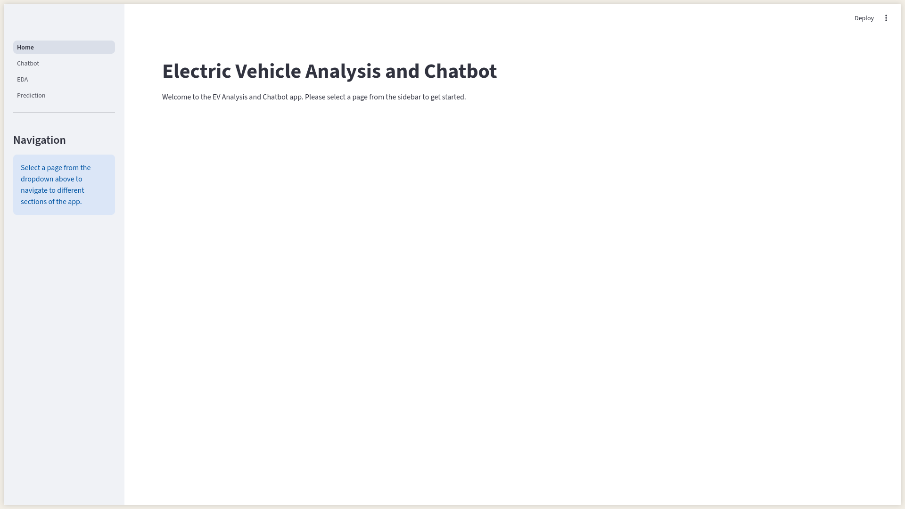
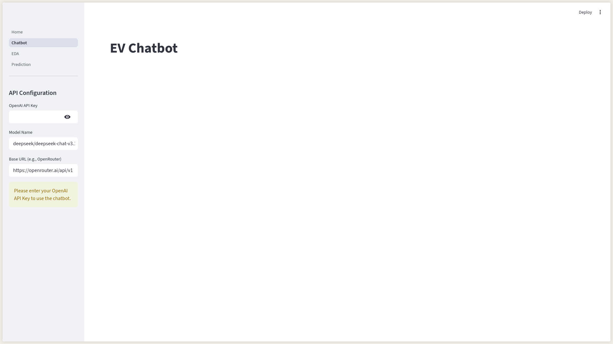
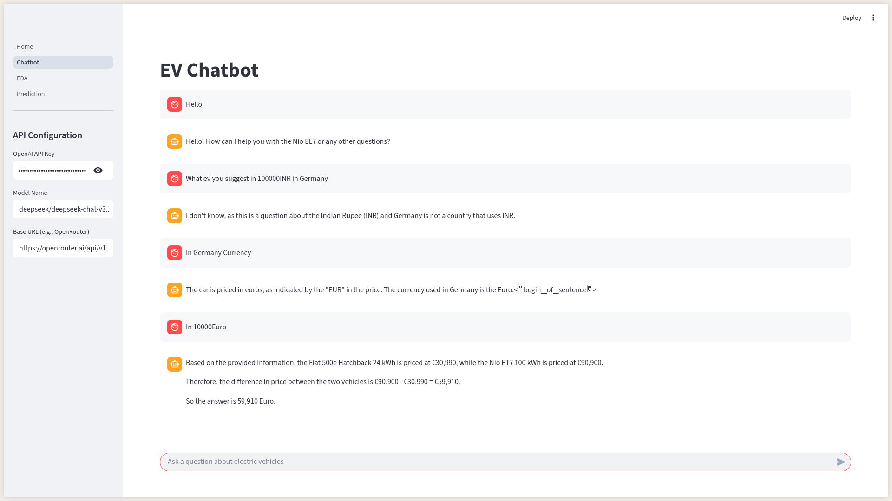
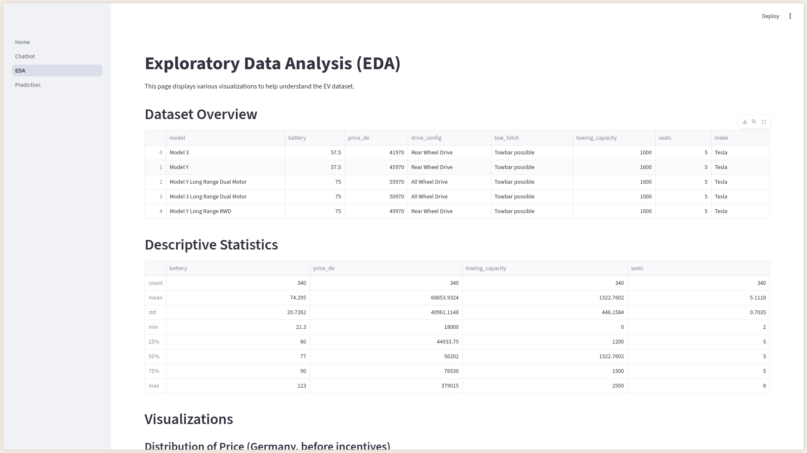
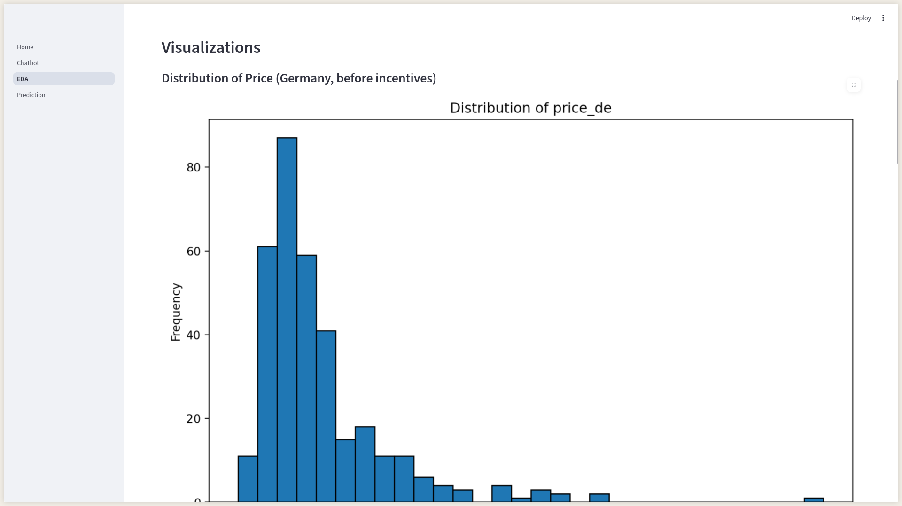
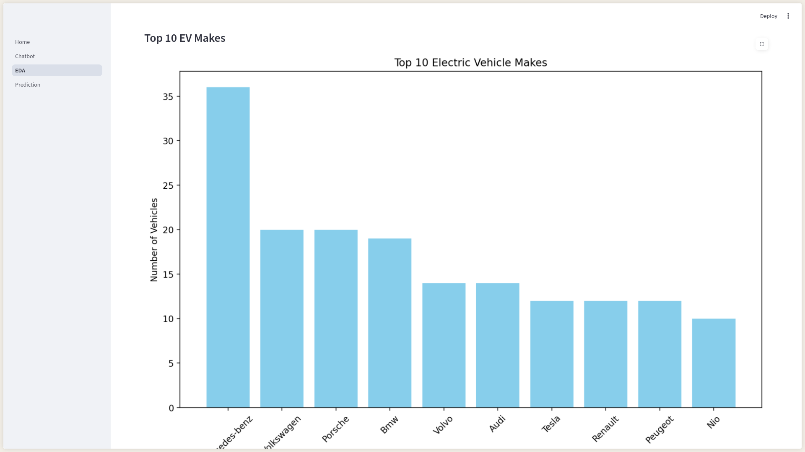
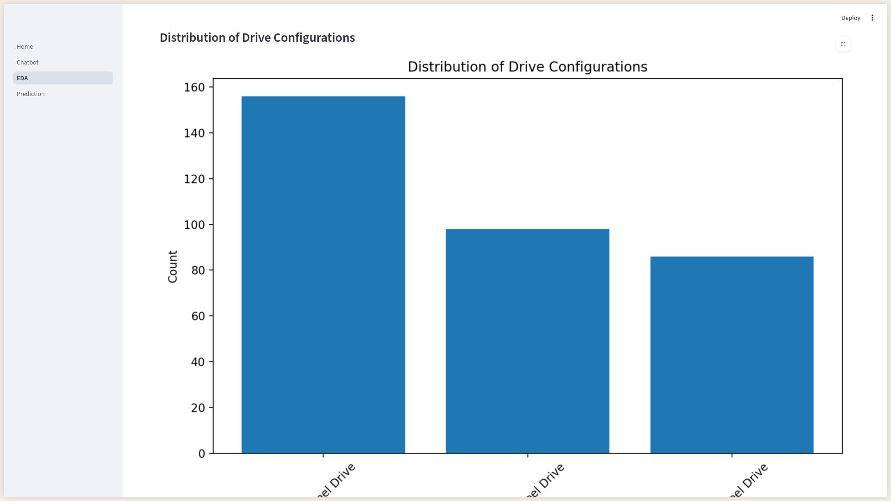
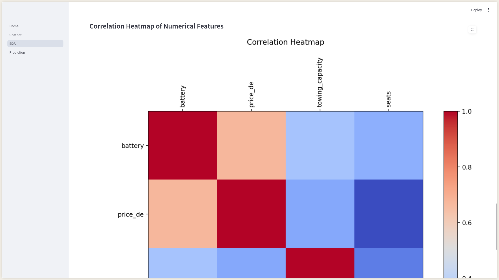
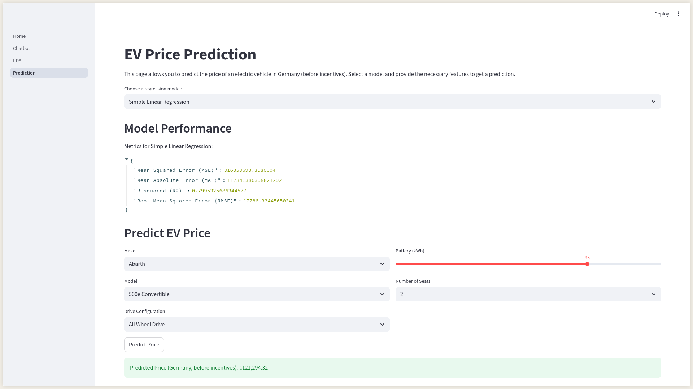

# Electric Vehicle Analysis and Chatbot

This project is a Streamlit web application that provides analysis and a chatbot for electric vehicle data. It's designed with a modular and clean architecture, using Python, LangChain, and Streamlit.

This is a week-wise task-based project. This is the result of the first week's task.

## Objective

The main objective of this project is to build a web-based platform for exploring and chatting about electric vehicle data. The application is divided into several sections, including data analysis, predictions, and a chatbot.

## Architecture

The project follows a modular architecture to ensure clean, maintainable, and scalable code. The main components are:

-   **`src/`**: The main source code directory.
    -   **`datasets/`**: Contains the raw data files.
    -   **`llm_config/`**: Configures the language model and embeddings.
    -   **`models/`**: Contains machine learning models.
    -   **`services/`**: Contains the business logic of the application, such as the chatbot service.
    -   **`streamlit_app/`**: Contains the Streamlit frontend application.
        -   **`pages/`**: Contains the different pages of the Streamlit app.
    -   **`utils/`**: Contains utility functions.
    -   **`vectorstore/`**: Handles the creation and management of the vector store.

## Folder Structure

```
/
├───.gitignore
├───README.md
├───requirements.txt
├───.venv2/
└───src/
    ├───llm_config/
    │   └───__init__.py
    │   └───llm_config.py
    ├───models/
    │   └───__init__.py
    │   └───regression.py
    ├───services/
    │   ├───__init__.py
    │   ├───chatbot_service.py
    │   └───data_service.py
    ├───utils/
    │   ├───__init__.py
    │   └───eda.py
    ├───vectorstore/
    │   ├───__init__.py
    │   └───vectorstore_service.py
    ├───streamlit_app/
    │   ├───main_app.py
    │   └───pages/
    │       ├───1_prediction.py
    │       ├───2_eda.py
    │       └───3_chatbot.py
    └───datasets/
        └───ev_raw_data.csv
```

## Setup and Installation

1.  **Clone the repository:**
    ```bash
    git clone <repository-url>
    cd gen-ai-week-1-task
    ```

2.  **Create a virtual environment:**
    This project uses `uv` as a package manager, which is a fast alternative to `pip`.
    First, install `uv`:
    ```bash
    pip install uv
    ```
    Then, create a virtual environment:
    ```bash
    uv venv .venv2
    ```

3.  **Activate the virtual environment:**
    ```bash
    source .venv2/bin/activate
    ```

4.  **Install dependencies:**
    ```bash
    uv pip install -r requirements.txt
    ```

5.  **Set up OpenAI API Key:**
    Create a file `.streamlit/secrets.toml` and add your OpenAI API key:
    ```toml
    [openai]
    api_key = "YOUR_OPENAI_API_KEY"
    ```

## How to Run

To run the Streamlit application, execute the following command in the root directory of the project:

```bash
streamlit run src/streamlit_app/main_app.py
```

## Advantages of this Architecture

-   **Modularity:** Each component has a specific responsibility, making the code easier to understand, test, and maintain.
-   **Scalability:** The modular design allows for easy addition of new features and components without affecting the rest of the application.
-   **Reusability:** Services and components can be easily reused in other parts of the application or in other projects.
-   **Clean Code:** The separation of concerns leads to cleaner and more readable code.

## Example Screenshots










